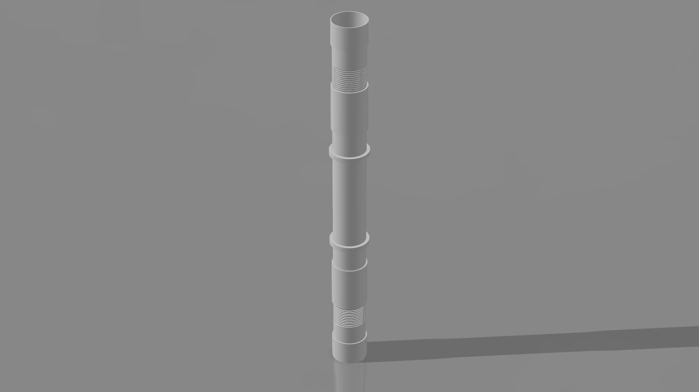

# Rainwater Harvesting Pre-Filtration System

**Hybrid Gutter + Meshed Filter**  
**Principles of Engineering Design** – BSc. Mechatronic Engineering, JKUAT

## Overview
A modular 3-part uPVC downpipe pre-filtration system designed to remove leaves, dust, bird droppings and suspended particles before water enters storage tanks. Combines coarse mesh screening with gravel filtration for **90–95% debris removal**.

## Problem & Objectives
- Heavy debris from rooftops contaminates harvested rainwater
- First-flush diverters insufficient for floating/suspended particles
- Target: Low-cost, locally fabricable, easy-maintenance solution for rural Kenya

## Engineering Design Process
1. **Problem Definition**
2. **Requirements & Objectives**
3. **Concept Generation** (Approaches A, B, C)
4. **Evaluation** using **Pugh’s Decision Matrix** (Weighted scoring)
5. **Detailed Design** – PED Filter Assembly
6. **Validation & Compliance**

**Selected Concept**: Hybrid Approach C (Highest score: **8.6/10**)

## Final Design Highlights
- **Material**: Unplasticized PVC (uPVC)
- **Connection**: M100×6 6g/6H threaded system (ISO 724)
- **Components**: 3-part modular (Main Body 600 mm + 2 Connectors + 2 Locking Sleeves)
- **Wall Thickness**: 12.01 mm (pressure-rated)
- **Maintenance**: Tool-free disassembly for gravel/mesh cleaning

## Repository Contents
- `presentation/` → Class slides
- `design/` → CAD, drawings, renders
- `reports/` → Full documentation & handwritten workflow

## Next Steps
- Physical prototype fabrication and testing
- Pressure & seal validation
- UV degradation and fatigue analysis

## Contributors
- Alex Wandugu
- Immanuel Luis 
- Jomo Kenyatta University of Agriculture and Technology

**License**: MIT (or Creative Commons for academic work)
